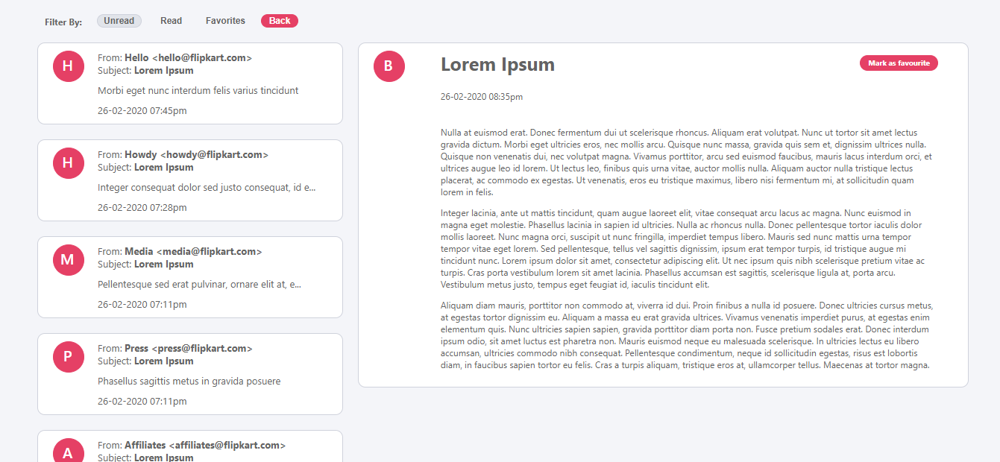
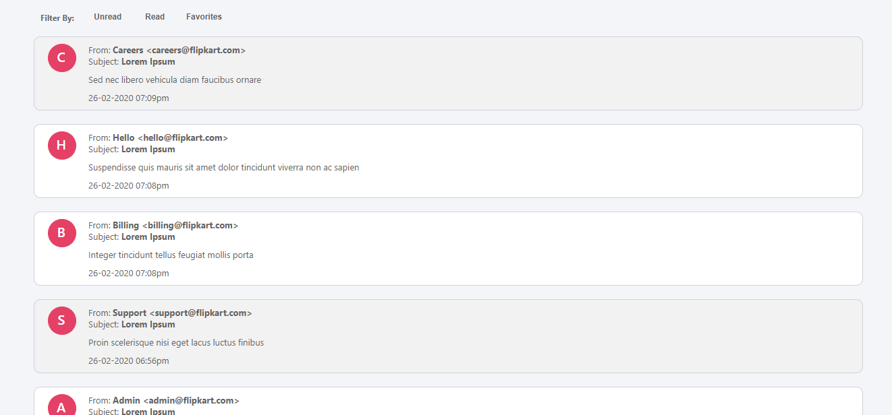
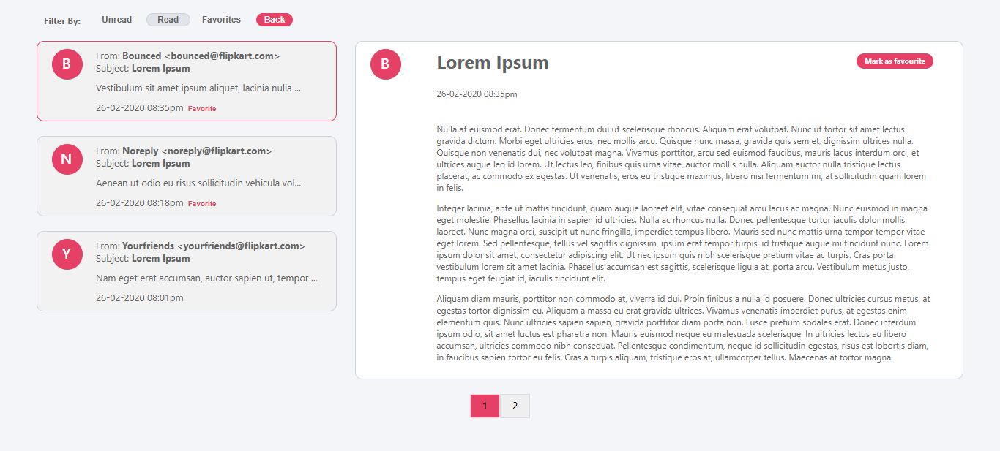
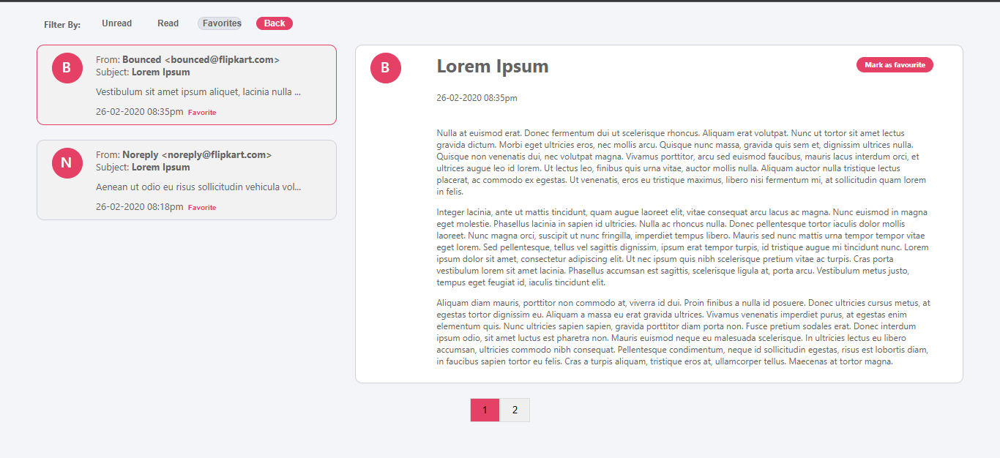
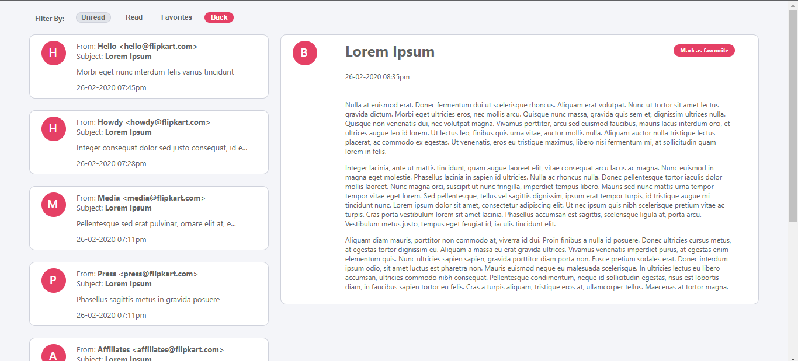

<h1>OutlookMail-clone App</h1>
<h2>Click here for <a href="https://outlookmail-clone.netlify.app/">Checkout</a></h2>

--Email with EmailBody ScreenShot

--EmailList ScreenShot

--Email Read ScreenShot

--Email Favorite ScreenShot

--Email UnRead ScreenShot

